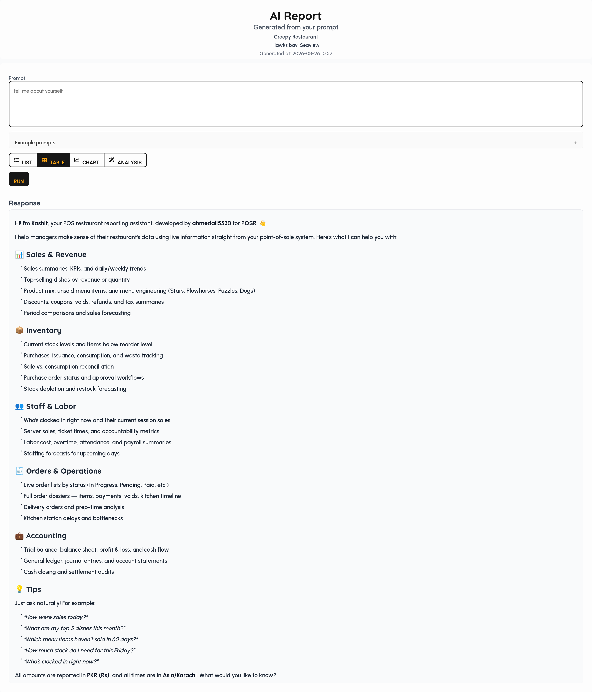

# POSR — AI-Powered Restaurant POS & Management System

**Offline-first, source-available restaurant POS software** for ordering, kitchen display (KDS), inventory, recipes, staff scheduling, payroll, accounting, delivery, fiscalization, and AI-powered restaurant analytics — delivered by **Kashif**, POSR's in-app AI assistant — in one platform.

POSR is a **source-available restaurant POS and restaurant management system** built for modern food businesses. It combines point-of-sale ordering, kitchen display systems (KDS), inventory and recipe management, staff scheduling and payroll, accounting, delivery, fiscalization (FBR / PRA), and AI restaurant analytics powered by **Kashif** in one **offline-first** platform.

React · TypeScript · Vite · Bun · SurrealDB · WebSockets · IndexedDB

## Links

- **[Documentation](https://ahmedali5530.xyz/posr/docs)**
- **[Get started — Installation & first sale](https://ahmedali5530.xyz/posr/docs)**
- **[Live demo](https://ahmedali5530.xyz/posr)** — pins `1234`, `0000`, `5555` (super admin)
- **[Landing / product](https://ahmedali5530.xyz/posr)**
- **Integrations framework (dev):** [docs/integrations/framework.md](docs/integrations/framework.md)
- **Auth gateway:** [docs/security/GATEWAY.md](docs/security/GATEWAY.md)

---

## Who is POSR for?

POSR is designed for **restaurants, cafés, coffee shops, bakeries, bars, hotels, cloud kitchens, food courts, catering, and multi-location restaurant groups** that need a full operations stack — not just a cash register.

## Why POSR?

Traditional restaurant POS software often depends on cloud connectivity and separate tools for inventory, accounting, staff, delivery, and analytics. POSR combines those workflows in one **offline-first, extensible** platform.

- **Source-available** — inspect, modify, extend, and self-host under [PSAL](LICENSE)
- **Offline-first** — keep selling during internet outages; sync when back online
- **AI-native** — **Kashif** for natural-language reporting, inventory/staff forecasts, and proposed configuration changes; plus AI Import for bulk file uploads
- **Real-time** — WebSocket sync across POS, KDS, manager, and delivery apps
- **Restaurant-specific** — tables, seats, modifiers, recipes, kitchen production, buffet, fiscalization
- **Extensible** — event-driven Integration Manager for fiscal, accounting, logging, and more

---

## Meet Kashif

**Kashif** is POSR's AI assistant for managers and back-office staff. Ask questions in plain language and get answers from **live POS data** — never guessed numbers. The same Kashif persona powers the **floating assistant** on back-office screens and the full-page **AI Report**.

**Where Kashif appears**

- **Floating assistant** — Manage, Inventory, Reports, HR, Accounts, Integrations, Tips, and Clock (hidden on cashier POS, KDS, and delivery screens)
- **AI Report** — dedicated reporting page with tables, charts, and analysis formats

**Ask Kashif (read-only, live data)**

- **Sales & service** — today's sales, voids, tips, discounts, coupons, menu mix, unsold items, server speed, staff accountability
- **Orders** — open orders by status, full **order dossier** (items, payments, kitchen, fiscal, prints)
- **Inventory** — stock on hand, purchases, issues, waste, adjustments, transfers, consumption vs issuance, purchase orders, suppliers, locations, **what to buy** (forecast from history, on-hand, holidays, weather, events)
- **Operations** — kitchen routing and station delays, cash/close audit, activity and fraud signals
- **Labor & HR** — labor cost, overtime, attendance, payroll, scheduled vs actual, **staff need forecast**, employee dossier, departments, positions, cost centers, leave
- **Accounts** — trial balance, balance sheet, P&L, cash flow, general ledger, journals, account statements
- **Manage config** — floors, tables, menus, discounts, users, roles, kitchens, printers, workflows, and more

**Tell Kashif what to change (proposals — you review and confirm)**

- **Menu & floor setup** — dishes, categories, modifiers, kitchens, workflows, tables, taxes, order/payment types, discounts (including BOGO), coupons, extras, printers
- **Inventory** — items, locations, suppliers, purchases, issues, waste, adjustments
- **HR** — employees, departments, positions, cost centers, shifts, leave, attendance corrections
- **Accounts** — chart of accounts, journal entries
- **Soft deletes** — dishes and kitchens (proposed, not immediate)

Write proposals use the same review-and-confirm pipeline as **AI Import** — Kashif prepares changes; nothing is saved until you confirm. Tools respect **RBAC** for the signed-in role. Conversations persist per user on this device (IndexedDB). AI usage quotas apply (see AI features below). Rename the assistant via `VITE_AI_ASSISTANT_NAME` (default: `Kashif`).

**Example prompts**

- *Give me a quick business health overview*
- *Compare net sales this week vs last week*
- *How much inventory do I need this Friday and what should I buy?*
- *How many staff do I need this Friday?*
- *Labor cost as a percentage of net sales this week*
- *Profit and loss for this month*
- *Flag order takers with void or discount rates above team average this week*

---

## Restaurant POS & Management Features

### AI restaurant analytics & reporting

- **Natural language analytics** — ask plain-text questions; get visual reports across sales, inventory, accounts, and labor
- **Descriptive analytics** — patterns, anomalies, voids/discounts, performance drivers
- **Sales forecasting** — demand prediction for staffing, purchasing, promotions
- **AI inventory forecasting** — purchase quantity suggestions from history, stock, holidays, weather, events
- **AI staff forecasting** — recommended hours/headcount vs schedule and same-weekday history
- **Order dossier** — full order timeline by ID, number, or invoice (dishes, voids, payments, kitchen, fiscal, prints)
- **Sales vs consumption** — recipe usage vs ledger issuance vs purchases
- **AI Import** — OCR/parse CSV, Excel, PDF, images, clipboard for master data, document lines, journals, HR shifts (create / update / upsert)
- **AI usage controls** — daily/monthly quotas; disable AI entirely

### Restaurant ordering & POS

- **Table-based ordering** — seat assignments, split by seat, multi-order tables
- **Takeaway mode** — pickup queue, customer name/phone/time
- **Order lifecycle** — split / merge / cancel / transfer / refunds
- **Modifiers** — groups, nested modifiers, price overrides, min/max rules
- **Visual menu builder** — dishes, categories, multi-category, tax rules
- **Multiple menus** — breakfast/lunch/dinner, dynamic pricing, delivery menu link
- **Extras & service charges** — fixed/%, rule-based by order type / payment / table
- **Discounts & coupons** — fixed/%, Buy X Get Y, payment-type promos, delivery coupons
- **Closing cycles** — auto check close, shift/day close, enforcement + notifications
- **Tips** — pooling, staff rules, shift allocation
- **Waiter app** — mobile order entry, table select, touch-optimized
- **Manager app** — dashboard, analytics, config, branch reporting

### Kitchen Display System (KDS)

- **Multi-stage KDS** — custom prep stages, station routing, status (received → served), recall
- **Grouped addons & voice alerts** — denser ticket grid; spoken alerts for new orders/addons

### Restaurant inventory & recipe management

- **Location-based stock** — stores/kitchens as inventory locations
- **Stock transfers** — location-to-location with ledger posting
- **Kitchen reconciliation** — theoretical (recipe × sales) vs actual by location
- **Kitchen production** — batch prep, yields, ingredient consumption
- **Buffet production** — portion planning, session close, replenishment
- **Recipe deduction** — stock-aware menus; auto deduct on sale
- **Documents** — purchase orders, purchases/returns, issues/returns, adjustments, waste
- **Inventory dashboard** — transfers, production, buffet, runout forecast, low-stock alerts
- **Suppliers** — supplier master + performance

### Restaurant staff scheduling & payroll

- **Shift scheduling** — create/assign schedules; **print schedule roster** (week grid, PDF/Excel)
- **Clock-in / clock-out** — work hours, late/early detection
- **Attendance** — history logs; bulk AI Import (pending until manager approve)
- **Leave & holidays** — paid/unpaid leave in payroll
- **Pay profiles** — hourly, daily wage, or flat period (monthly/weekly/contract)
- **Payroll runs** — preview, overrides, approve/post
- **Org structure** — employees, departments, positions, cost centers, branch assignment
- **RBAC** — admin, manager, waiter, kitchen, delivery, custom roles; protected modules (web + mobile)

### Restaurant accounting & payments

- **Internal ledger** — chart of accounts, journals, GL / TB / BS / P&L style reporting
- **Closing & reconciliation** — checks, shifts, days; audit-ready payment trail
- **Payment gateways** — Stripe, PayPal, JazzCash, M-Pesa, Telebirr, Razorpay (sandbox/live, webhooks)
- **QuickBooks Online** — OAuth; sync sales, payments, customers, refunds; journals for inventory/payroll/waste; import COA / vendors / tax codes
- **Fiscal (Pakistan)** — **FBR** and **PRA** invoice submission at settlement (API-proxied); receipt logos / QR

### Restaurant delivery management

- **Delivery app** — dispatch, driver tracking, Google Maps, realtime customer updates
- **Smart coupons** — fixed/%/free shipping, usage limits, time windows, first-order rules

### Integration Manager

- **Plugin hub** — enable/configure providers without coupling POS screens ([framework docs](docs/integrations/framework.md))
- **Event-driven** — fan-out sales, inventory, HR, accounts, ops, lifecycle, and `EntityChanged` master-data events
- **Offline queue** — retries, dedupe, IndexedDB persistence; settlement not blocked by slow APIs
- **Health & audit** — provider health, job queue UI, audit log
- **Integrations UI** — providers, configuration, queue, health panels
- **Permissions** — toggle provider, open/save configuration (manager PIN when missing)
- **Providers (shipped):**
  - **FBR Fiscalization** — FBR invoices at settlement
  - **PRA Fiscalization** — PRA invoices at settlement
  - **Internal Accounting** — draft journals from sales, refunds, payroll, purchases, waste, issues, transfers, production
  - **Internal Inventory** — inventory integration hooks
  - **QuickBooks Online** — external accounting sync (see above)
  - **Event Logger** — all/filtered events → console or HTTP (bearer / API key / basic / JWT)

### Offline-first platform

- **Offline-first** — IndexedDB + realtime WebSocket sync; automatic cloud backups
- **Auth gateway** — session JWT; Surreal credentials not shipped to browser ([GATEWAY.md](docs/security/GATEWAY.md))
- **ESC/POS printing** — USB, Serial, Network, Bluetooth; kitchen tickets, receipts, delivery slips, pre-sale bills, sales summaries; custom logos
- **Multi-lingual** — English, Español, Türkçe, Português, Français, Nederlands, Deutsch, Italiano, العربية (RTL), Русский (Cyrillic); live language switch
- **Tech stack** — React + TypeScript, Bun + Vite, SurrealDB, WebSockets

---

## See it in action


- [Watch full video](https://ahmedali5530.xyz/assets/posr/demo.mp4)
- [Order taking app flow](https://www.youtube.com/watch?v=VP3zBUfHtYQ&list=PLAnQKFs1ybdM&pp=sAgC)

## Screenshots





---

## Quick Start

Full install and first-sale walkthrough: **[Documentation → Get started](https://ahmedali5530.xyz/posr/docs)**

```bash
git clone https://github.com/ahmedali5530/restaurant-pos
cd restaurant-pos
cp .env.example .env
cp api/.env.example api/.env
cp gateway/.env.example gateway/.env
cp payments/.env.example payments/.env
bun install
docker compose up -d
```

Copied `.env` files include **local-dev** Surreal and JWT values. Change `SURREAL_USER`, `SURREAL_PASS`, and `GATEWAY_JWT_SECRET` before any non-localhost deploy. `root`/`root` is rejected.

**Auth gateway (default):** SPA uses port **3142**, not Surreal **8000**. Set `VITE_GATEWAY_URL` / `VITE_DB_WEBDOCKET` to the gateway; do **not** set `VITE_DB_USER` / `VITE_DB_PASS` in the browser bundle. Details and rollback: [docs/security/GATEWAY.md](docs/security/GATEWAY.md).

---

## Roadmap

1. [ ] Multi-branch synchronization improvements
2. [ ] Extend AI to CRUD / autonomous operations
3. [ ] QR code and self-ordering
4. [ ] Tap-to-pay on mobile apps
5. [ ] Targeted sales / performance
6. [ ] Multi-currency support
7. [ ] Loyalty module

---

## Contributing

Fork → feature branch → PR. Stars help visibility.

---

## License

**POSR Source Available License (PSAL) v1.0** — see [LICENSE](LICENSE).

POSR is **source-available** (not OSI “open source”): you may view, study, clone, fork, modify; build plugins/connectors; run your own business (any locations); hire contractors to maintain it.

- No selling/reselling the Software as a product; no hosted multi-tenant SaaS; no white-label competing POS.

Commercial license / white-label / OEM: **ahmedali5530@gmail.com**.
